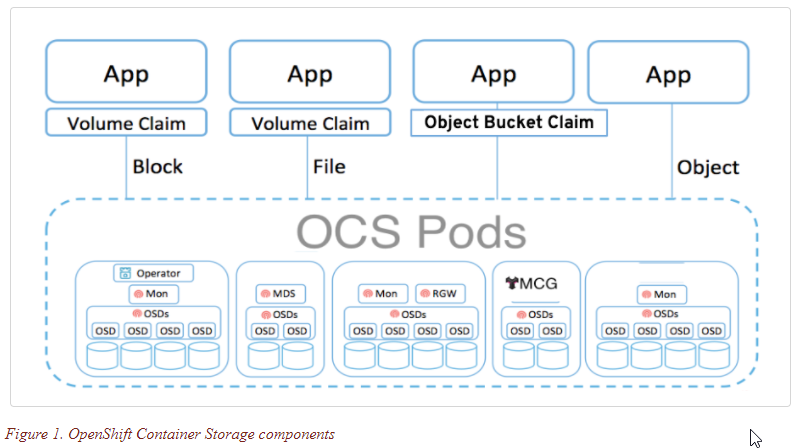
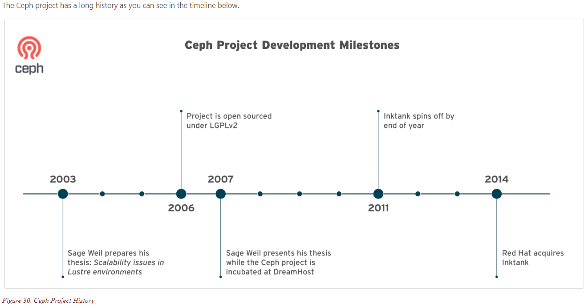
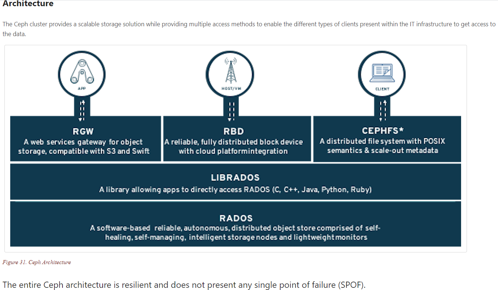
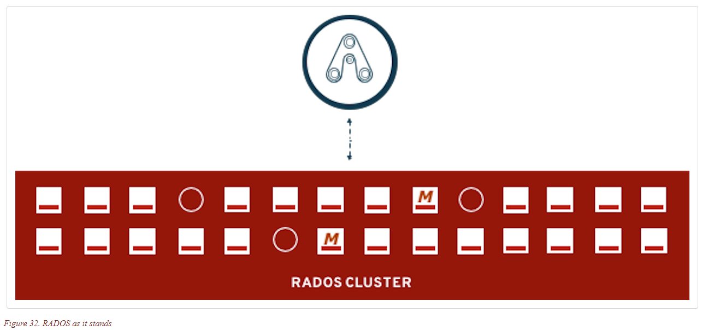

# Introduction to Ceph
How to deploy and manage OpenShift Container Storage (OCS). In this module you will be using OpenShift Container Platform (OCP) 4.x and the OCS operator to deploy Ceph and the Multi-Cloud-Gateway (MCG) as a persistent storage solution for OCP workloads.

In this lab you will learn how to
* Configure and deploy containerized Ceph and NooBaa
* Validate deployment of containerized Ceph and NooBaa
* Deploy the Rook toolbox to run Ceph and RADOS commands
* Creating a Read-Write-Once (RWO) PVC that is based on Ceph RBDs
* Creating a Read-Write-Many (RWX) PVC that is based on CephFS
* Use OCS for Prometheus and AlertManager storage
* Use the MCG to create a bucket and use in an application
* Add more storage to the Ceph cluster
* Use must-gather to collect support information

## RADOS
The heart of Ceph is an object store known as RADOS (Reliable Autonomic Distributed Object Store) bottom layer on the screen. This layer provides the Ceph software defined storage with the ability to store data (serve IO requests, to protect the data, to check the consistency and the integrity of the data through built-in mechanisms. The RADOS layer is composed of the following daemons:
	1. MONs or Monitors
	2. OSDs or Object Storage Devices
	3. MGRs or Managers
	4. MDSs or Meta Data Servers

### Monitors
The Monitors maintain the cluster map and state and provide distributed decision-making while configured in an odd number, 3 or 5 depending on the size and the topology of the cluster, to prevent split-brain situations. The Monitors are not in the data-path and do not serve IO requests to and from the clients.

### OSDs
One OSD is typically deployed for each local block devices and the native scalable nature of Ceph allows for thousands of OSDs to be part of the cluster. The OSDs are serving IO requests from the clients while guaranteeing the protection of the data (replication or erasure coding), the rebalancing of the data in case of an OSD or a node failure, the coherence of the data (scrubbing and deep-scrubbing of the existing data).

### MGRs
The Managers are tightly integrated with the Monitors and collect the statistics within the cluster. Additionally they provide an extensible framework for the cluster through a pluggable Python interface aimed at expanding the Ceph existing capabilities. The current list of modules developed around the Manager framework are:
	• Balancer module
	• Placement Group auto-scaler module
	• Dashboard module
	• RESTful module
	• Prometheus module
	• Zabbix module
	• Rook module

### MDSs
The Meta Data Servers manage the metadata for the POSIX compliant shared filesystem such as the directory hierarchy and the file metadata (ownership, timestamps, mode, …​). All the metadata is stored with RADOS and they do not server any data to the clients. MDSs are only deployed when a shared filesystem is configured in the Ceph cluster.

If we look at the Ceph cluster foundation layer, the full picture with the different types of daemons or containers looks like this.

