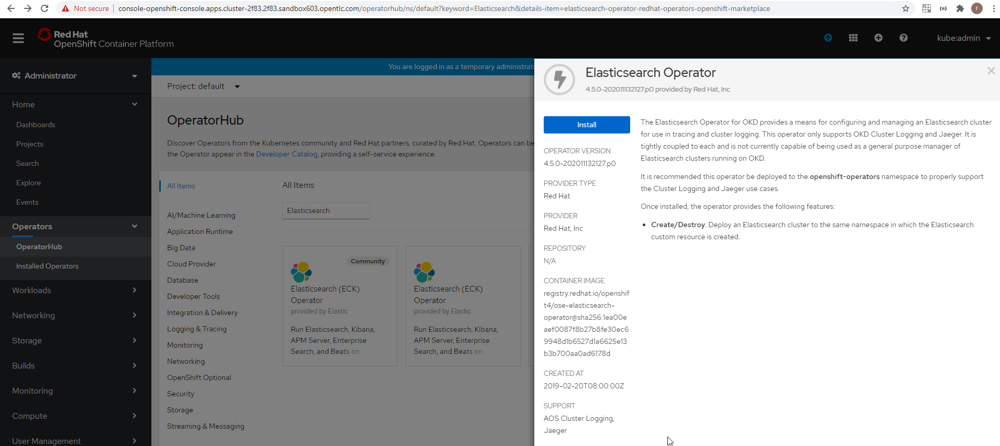
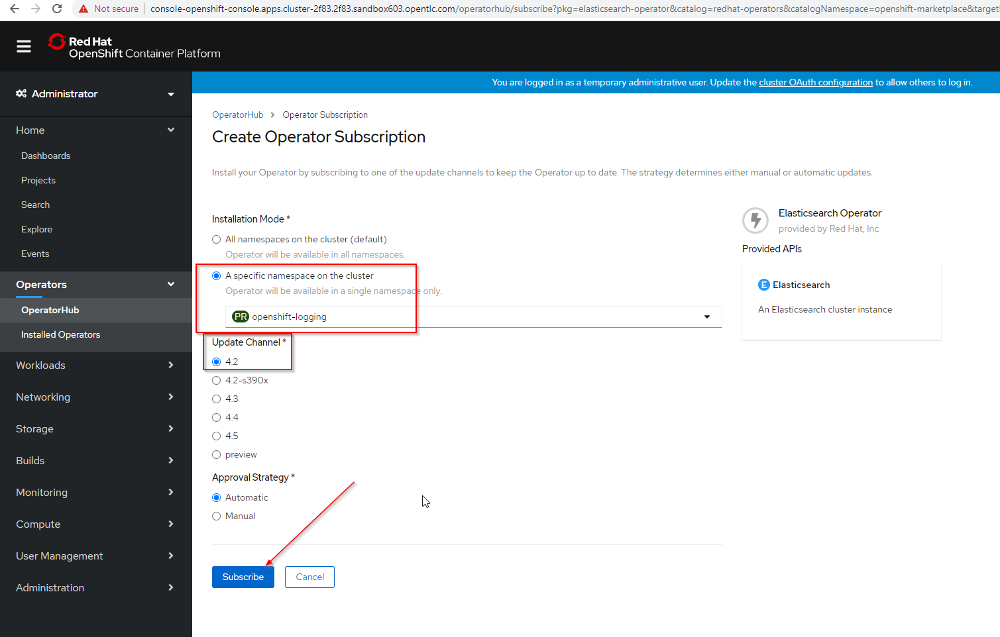
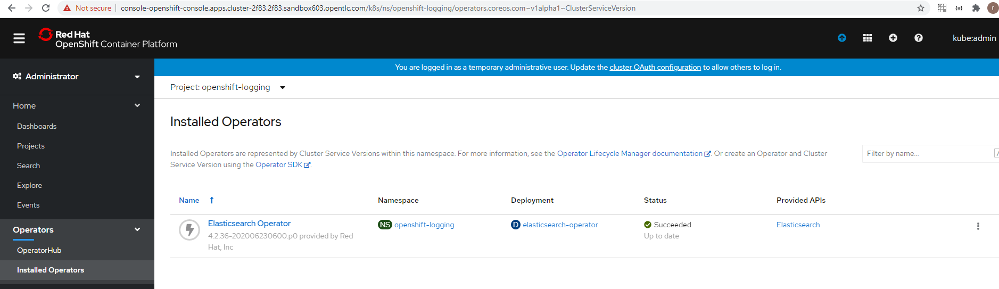
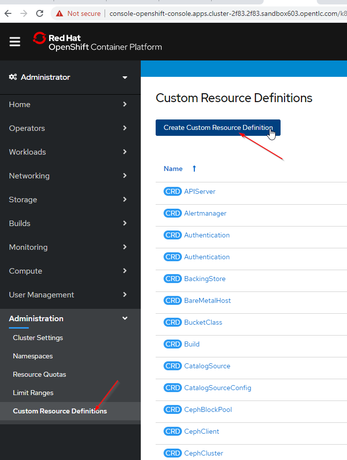
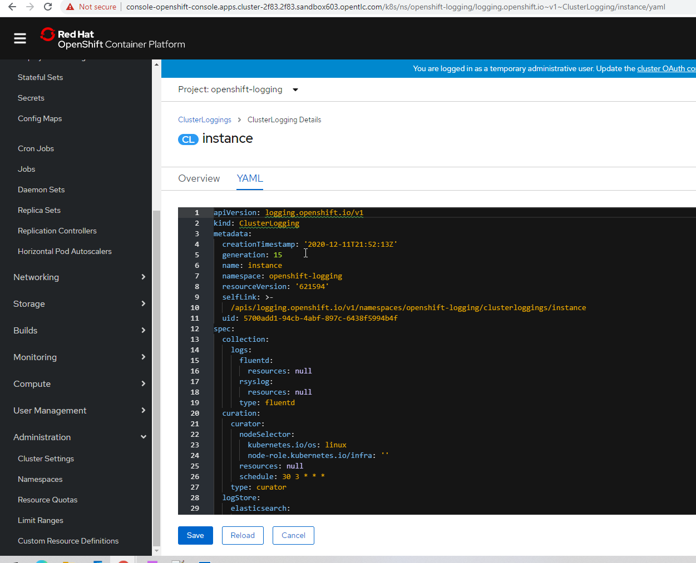
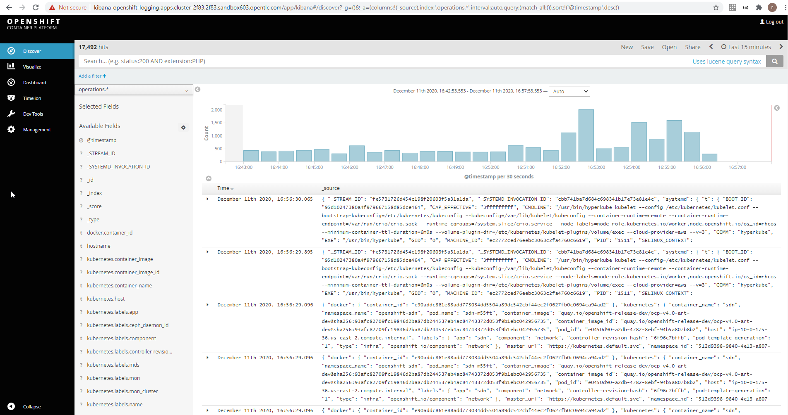

# OpenShift Log Aggregation
An extremely important function of OpenShift is collecting and aggregating logs from the environments and the application pods it is running. OpenShift ships with an elastic log aggregation solution: EFK. (ElasticSearch, Fluentd and Kibana)

## Deploying OpenShift Logging

```
Create the openshift-logging namespace
openshift_logging_namespace.yaml
apiVersion: v1
kind: Namespace
metadata:
  name: openshift-logging
  annotations:
    openshift.io/node-selector: ""
  labels:
    openshift.io/cluster-logging: "true"
    openshift.io/cluster-monitoring: "true"
```

## Install the Elasticsearch and Cluster Logging Operators in the cluster





## Create the Loggging CustomResource (CR) instance

```
openshift_logging_cr.yaml

apiVersion: "logging.openshift.io/v1"
kind: "ClusterLogging"
metadata:
  name: "instance"
  namespace: "openshift-logging"
spec:
  managementState: "Managed"
  logStore:
    type: "elasticsearch"
    elasticsearch:
      nodeCount: 3
      storage:
         storageClassName: ocs-storagecluster-ceph-rbd
         size: 100Gi
      redundancyPolicy: "SingleRedundancy"
      nodeSelector:
        node-role.kubernetes.io/infra: ""
      resources:
        request:
          memory: 4G
  visualization:
    type: "kibana"
    kibana:
      replicas: 1
      nodeSelector:
        node-role.kubernetes.io/infra: ""
  curation:
    type: "curator"
    curator:
      schedule: "30 3 * * *"
      nodeSelector:
        node-role.kubernetes.io/infra: ""
  collection:
    logs:
      type: "fluentd"
      fluentd: {}
      nodeSelector:
        node-role.kubernetes.io/infra: ""
```




YAML: from above



```
oc get pods -n openshift-logging
	NAME                                            READY   STATUS              RESTARTS   AGE
	cluster-logging-operator-847c6b467d-gqwlv       1/1     Running             0          12m
	elasticsearch-cdm-119iz55y-1-f6b6954cd-l2vwb    0/2     ContainerCreating   0          33s
	elasticsearch-cdm-119iz55y-2-675c5bf758-zvp9z   0/2     ContainerCreating   0          0s
	elasticsearch-operator-744647f564-7l7f9         1/1     Running             0          29m
	fluentd-4tn6p                                   0/1     ContainerCreating   0          33s
	fluentd-7cnbh                                   1/1     Running             0          33s
	fluentd-7qmt2                                   1/1     Running             0          33s
	fluentd-7tqw9                                   1/1     Running             0          33s
	fluentd-7z48b                                   1/1     Running             0          32s
	fluentd-94jnj                                   1/1     Running             0          33s
	fluentd-9zc9l                                   1/1     Running             0          33s
	fluentd-dq59w                                   1/1     Running             0          32s
	fluentd-fvzcq                                   1/1     Running             0          32s
	fluentd-grtd2                                   1/1     Running             0          32s
	fluentd-ppcvj                                   1/1     Running             0          33s
	fluentd-srln2                                   1/1     Running             0          33s
	fluentd-ssxp9                                   1/1     Running             0          33s
	fluentd-w7cmw                                   1/1     Running             0          33s
	fluentd-zwzk8                                   1/1     Running             0          33s
	kibana-64b79bb76b-wq9b2                         0/2     ContainerCreating   0          33s
	
oc get daemonset -n openshift-logging
	NAME      DESIRED   CURRENT   READY   UP-TO-DATE   AVAILABLE   NODE SELECTOR            AGE
	fluentd   15        15        15      15           15          kubernetes.io/os=linux   2m40s

oc get pvc -n openshift-logging
	NAME                                         STATUS   VOLUME                                     CAPACITY   ACCESS MODES   STORAGECLASS                  AGE
	elasticsearch-elasticsearch-cdm-119iz55y-1   Bound    pvc-925f8f8c-2589-4604-8f28-6e944b748a06   100Gi      RWO            ocs-storagecluster-ceph-rbd   3m19s
	elasticsearch-elasticsearch-cdm-119iz55y-2   Bound    pvc-a1eecd6b-b2d7-4c7b-b91b-5f2fa65021d2   100Gi      RWO            ocs-storagecluster-ceph-rbd   3m19s
	elasticsearch-elasticsearch-cdm-119iz55y-3   Bound    pvc-efebc6d8-2f4f-4ecf-8dbf-8173b94dffe0   100Gi      RWO            ocs-storagecluster-ceph-rbd   3m19s
```

## Accessing Kibana

```
oc get route -n openshift-logging
	NAME     HOST/PORT                                                                PATH   SERVICES   PORT    TERMINATION          WILDCARD
	kibana   kibana-openshift-logging.apps.cluster-2f83.2f83.sandbox603.opentlc.com          kibana     <all>   reencrypt/Redirect   None
```



