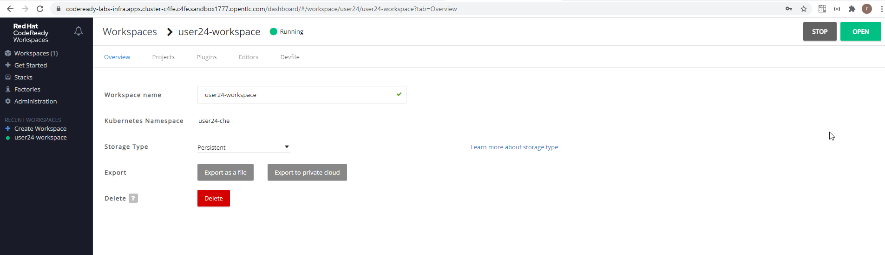
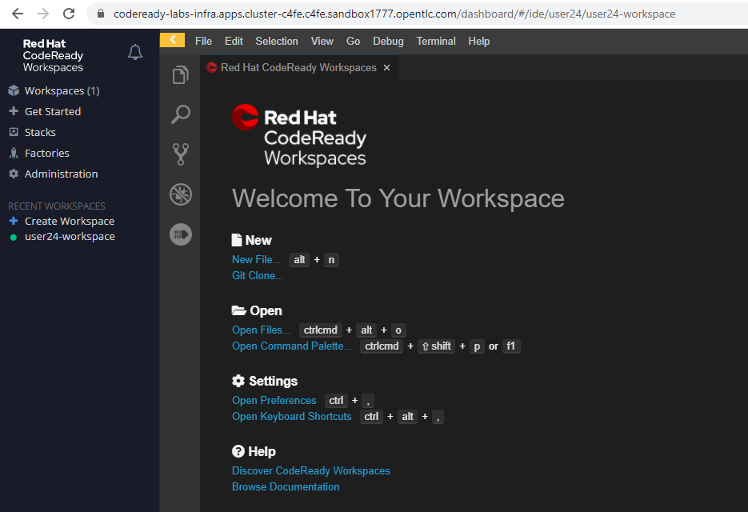
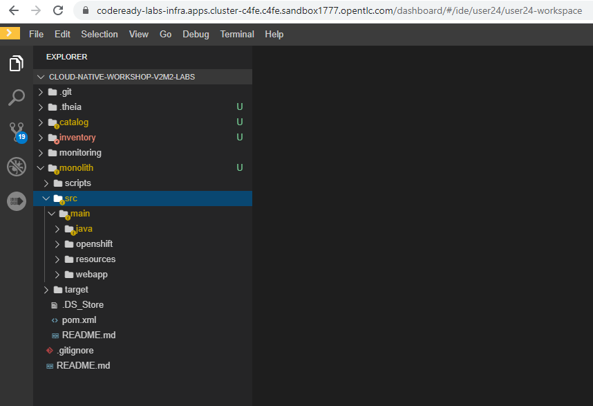
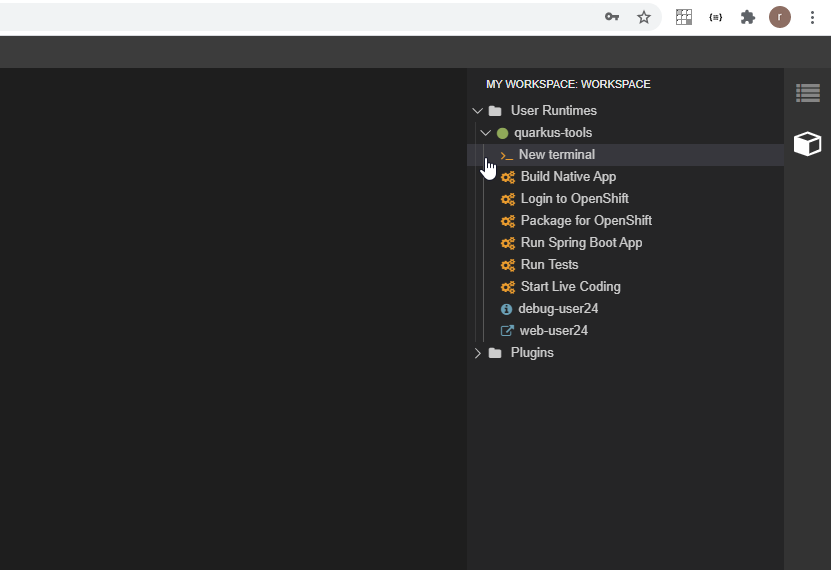
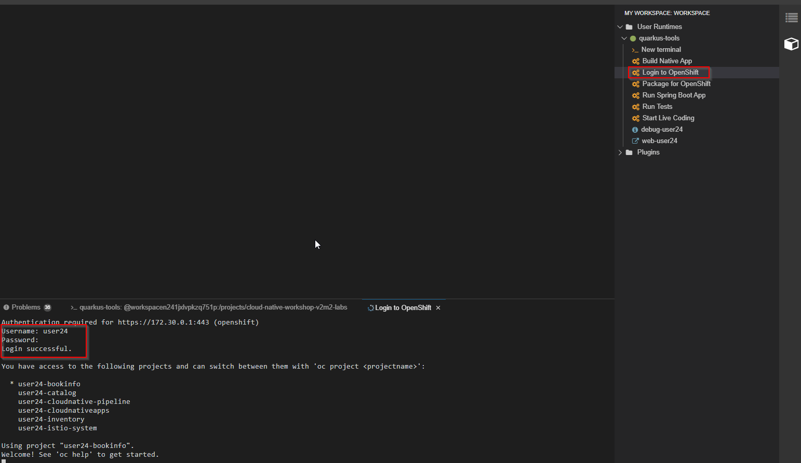
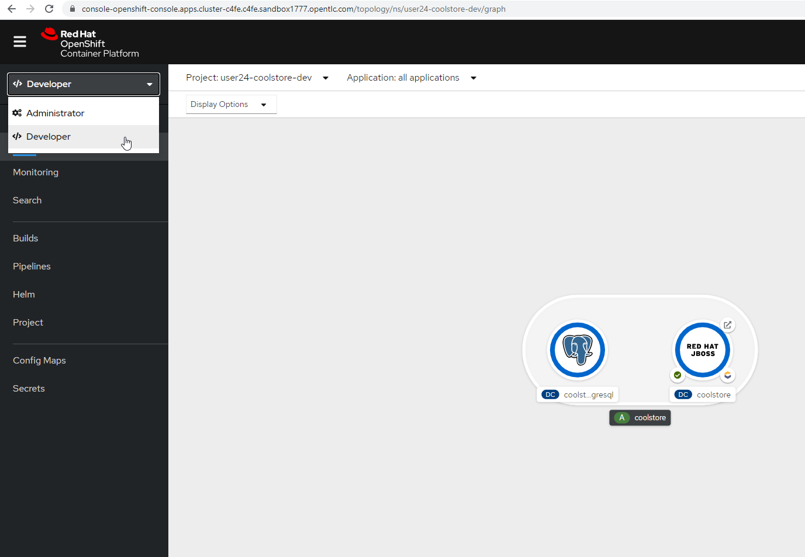
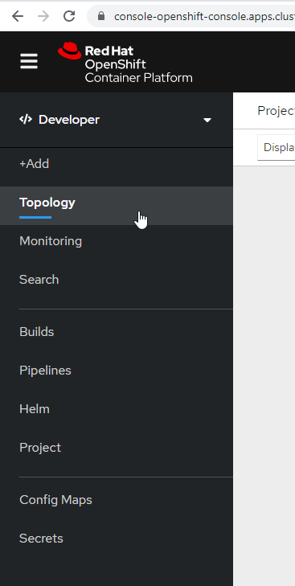
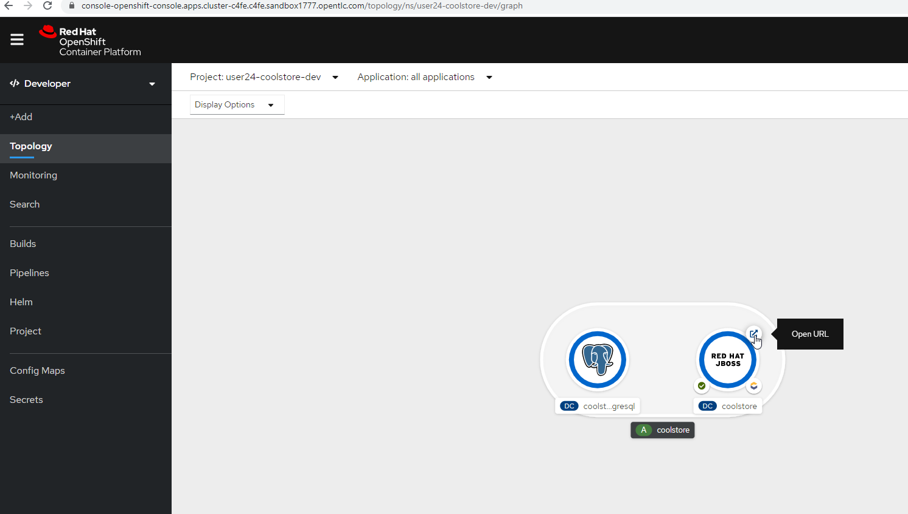

# Debugging

https://codeready-labs-infra.apps.cluster-c4fe.c4fe.sandbox1777.opentlc.com/dashboard/#/workspaces

user24/r3dh4t1!






https://github.com/RedHat-Middleware-Workshops/cloud-native-workshop-v2m2-labs.git







In the terminal:

```
sh /projects/cloud-native-workshop-v2m2-labs/monolith/scripts/deploy-inventory.sh user24 && \
sh /projects/cloud-native-workshop-v2m2-labs/monolith/scripts/deploy-catalog.sh user24 && \
sh /projects/cloud-native-workshop-v2m2-labs/monolith/scripts/deploy-coolstore.sh user24
```

Run these commands to inspect the elements via CodeReady Workspaces Terminal window:

```
oc project user24-coolstore-dev && \
oc get bc coolstore && \
oc get is coolstore && \
oc get dc coolstore && \
oc get svc coolstore && \
oc describe route www
	Already on project "user24-coolstore-dev" on server "https://172.30.0.1:443".
	NAME        TYPE     FROM     LATEST
	coolstore   Source   Binary   1
	NAME        IMAGE REPOSITORY                                                                  TAGS     UPDATED
	coolstore   image-registry.openshift-image-registry.svc:5000/user24-coolstore-dev/coolstore   latest   47 seconds ago
	NAME        REVISION   DESIRED   CURRENT   TRIGGERED BY
	coolstore   1          1         1         config,image(coolstore:latest)
	NAME        TYPE        CLUSTER-IP    EXTERNAL-IP   PORT(S)    AGE
	coolstore   ClusterIP   172.30.1.90   <none>        8080/TCP   119s
	Name:                   www
	Namespace:              user24-coolstore-dev
	Created:                About a minute ago
	Labels:                 app=coolstore-monolith-binary-build
	                        app.kubernetes.io/component=coolstore-monolith-binary-build
	                        app.kubernetes.io/instance=coolstore-monolith-binary-build
	                        application=coolstore
	                        template=coolstore-monolith-binary-build
	Description:            Route for application's http service.
	Annotations:            openshift.io/generated-by=OpenShiftNewApp
	                        openshift.io/host.generated=true
	Requested Host:         www-user24-coolstore-dev.apps.cluster-c4fe.c4fe.sandbox1777.opentlc.com
	                          exposed on router default (host apps.cluster-c4fe.c4fe.sandbox1777.opentlc.com) about a minute ago
	Path:                   <none>
	TLS Termination:        <none>
	Insecure Policy:        <none>
	Endpoint Port:          <all endpoint ports>
	
	Service:        coolstore
	Weight:         100 (100%)
	Endpoints:      <none>
	[jboss@workspacen241jxlvpkzq751p cloud-native-workshop-v2m2-labs]$ 
```

### Topology View

https://console-openshift-console.apps.cluster-c4fe.c4fe.sandbox1777.opentlc.com/topology/ns/user24-coolstore-dev







http://www-user24-coolstore-dev.apps.cluster-c4fe.c4fe.sandbox1777.opentlc.com/#/

### Verify Database

```
oc rsh dc/coolstore-postgresql
	I1217 17:20:16.640610    1227 request.go:621] Throttling request took 1.167408013s, request: GET:https://172.30.0.1:443/apis/snapshot.storage.k8s.io/v1beta1?timeout=32s
	sh-4.2$ 
	
sh-4.2$ psql -U $POSTGRESQL_USER $POSTGRESQL_DATABASE -c 'select name,price from PRODUCT_CATALOG;' | cat; exit
	              name               | price 
	---------------------------------+-------
	 Quarkus T-shirt                 |    10
	 Pronounced Kubernetes           |     9
	 Knit socks                      |  4.15
	 Quarkus H2Go water bottle       | 14.45
	 Patagonia Refugio pack 28L      |     6
	 Red Hat Impact T-shirt          |     9
	 Quarkus twill cap               |    13
	 Women RHEL 8 t-shirt            |    10
	 Nanobloc Universal Webcam Cover |  2.75
	(9 rows)
	
	exit
	[jboss@workspacen241jxlvpkzq751p cloud-native-workshop-v2m2-labs]$ 
```

This shows the content of the monolith’s database.

