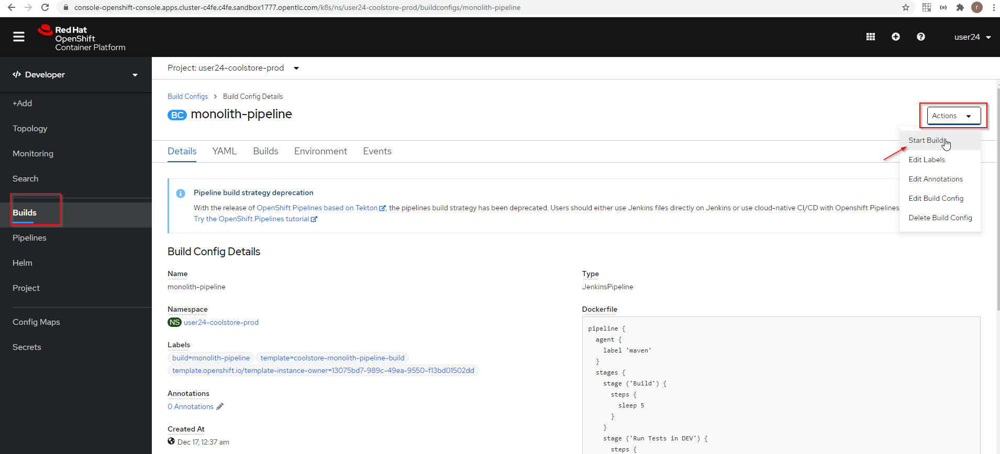

# Implementing Continuous Delivery

## Create Project:


## Add the production elements


### Label the components so that they get proper icons by running this command in the CodeReady Terminal:

```
oc project user24-coolstore-prod && \
oc label dc/coolstore-prod-postgresql app.openshift.io/runtime=postgresql --overwrite && \
oc label dc/coolstore-prod app.openshift.io/runtime=jboss --overwrite && \
oc label dc/coolstore-prod-postgresql app.kubernetes.io/part-of=coolstore-prod --overwrite && \
oc label dc/coolstore-prod app.kubernetes.io/part-of=coolstore-prod --overwrite && \
oc annotate dc/coolstore-prod app.openshift.io/connects-to=coolstore-prod-postgresql --overwrite && \
oc annotate dc/coolstore-prod app.openshift.io/vcs-uri=https://github.com/RedHat-Middleware-Workshops/cloud-native-workshop-v2m2-labs.git --overwrite && \
oc annotate dc/coolstore-prod app.openshift.io/vcs-ref=ocp-4.5 --overwrite
	Now using project "user24-coolstore-prod" on server "https://172.30.0.1:443".
	I1217 17:39:20.697611    1281 request.go:621] Throttling request took 1.169356104s, request: GET:https://172.30.0.1:443/apis/serving.knative.dev/v1alpha1?timeout=32s
	deploymentconfig.apps.openshift.io/coolstore-prod-postgresql labeled
	deploymentconfig.apps.openshift.io/coolstore-prod labeled
	deploymentconfig.apps.openshift.io/coolstore-prod-postgresql labeled
	deploymentconfig.apps.openshift.io/coolstore-prod labeled
	deploymentconfig.apps.openshift.io/coolstore-prod annotated
	deploymentconfig.apps.openshift.io/coolstore-prod annotated
	deploymentconfig.apps.openshift.io/coolstore-prod annotated
```


### We will use a Jenkins Server in our project and use a Jenkins Pipeline build strategy.


### Label the new Jenkins server:
```
oc label dc/jenkins app.openshift.io/runtime=jenkins --overwrite
	deploymentconfig.apps.openshift.io/jenkins labeled
```

## Promoting Apps Across Environments with Pipelines
### Inspect the Pipeline Definition


### Inspect this via the following command via CodeReady Workspaces Terminal window:

```
oc describe bc/monolith-pipeline -n user24-coolstore-prod
	I1217 17:51:26.796952    1446 request.go:621] Throttling request took 1.170104345s, request: GET:https://172.30.0.1:443/apis/serving.knative.dev/v1alpha1?timeout=32s
	Name:           monolith-pipeline
	Namespace:      user24-coolstore-prod
	Created:        14 minutes ago
	Labels:         build=monolith-pipeline
	                template=coolstore-monolith-pipeline-build
	                template.openshift.io/template-instance-owner=13075bd7-989c-49ea-9550-f13bd01502dd
	Annotations:    <none>
	Latest Version: Never built
	
	Strategy:       JenkinsPipeline
	Jenkinsfile contents:
	  pipeline { 
	    agent {
	      label 'maven'
	    }
	    stages {
	      stage ('Build') {
	        steps {
	          sleep 5
	        }
	      }
	      stage ('Run Tests in DEV') {
	        steps {
	          sleep 10
	        }
	      }
	      stage ('Deploy to PROD') {
	        steps {
	          script {
	            openshift.withCluster() {
	              openshift.tag("user24-coolstore-dev/coolstore:latest", "user24-coolstore-prod/coolstore:prod")
	            }
	          }
	        }
	      }
	      stage ('Run Tests in PROD') {
	        steps {
	          sleep 30
	        }
	      }
	    }
	  }
	Empty Source:   no input source provided
	
	Build Run Policy:       Serial
	Triggered by:           <none>
	Webhook GitHub:
	        URL:    https://172.30.0.1:443/apis/build.openshift.io/v1/namespaces/user24-coolstore-prod/buildconfigs/monolith-pipeline/webhooks/<secret>/github
	Webhook Generic:
	        URL:            https://172.30.0.1:443/apis/build.openshift.io/v1/namespaces/user24-coolstore-prod/buildconfigs/monolith-pipeline/webhooks/<secret>/generic
	        AllowEnv:       false
	Builds History Limit:
	        Successful:     5
	        Failed:         5
	
	Events: <none>
	[jboss@workspacen241jxlvpkzq751p cloud-native-workshop-v2m2-labs]$
```

## Promote the dev image to production using the pipeline


https://jenkins-user24-coolstore-prod.apps.cluster-c4fe.c4fe.sandbox1777.opentlc.com/job/user24-coolstore-prod/job/user24-coolstore-prod-monolith-pipeline/1/console



### In Jenkins


### In OpenShift


Return to the Topology View and notice that the application is now deployed and running! (Blue Circle)


### Adding Pipeline Approval Steps
```
stage ('Approve Go Live') {
    steps {
    timeout(time:30, unit:'MINUTES') {
        input message:'Go Live in Production (switch to new version)?'
    }
    }
}
```


## Make a simple change to the app


Now we need to update the catalog endpoint in the monolith application. Run the following commands in a Terminal to update the baseUrl to the proper value with your username:

```
JSPATH="$CHE_PROJECTS_ROOT/cloud-native-workshop-v2m2-labs/monolith/src/main/webapp/app/services/catalog.js"
CATALOGHOST=$(oc get route -n user24-catalog catalog-springboot -o jsonpath="{.spec.host}")
sed -i 's/REPLACEURL/'$CATALOGHOST'/' "$JSPATH"

	[jboss@workspacen241jxlvpkzq751p cloud-native-workshop-v2m2-labs]$ CATALOGHOST=$(oc get route -n user24-catalog catalog-springboot -o jsonpath="{.spec.host}")
	
	I1217 18:04:45.907993    1478 request.go:621] Throttling request took 1.160071042s, request: GET:https://172.30.0.1:443/apis/networking.istio.io/v1alpha3?timeout=32s
	[jboss@workspacen241jxlvpkzq751p cloud-native-workshop-v2m2-labs]$ sed -i 's/REPLACEURL/'$CATALOGHOST'/' "$JSPATH"
	[jboss@workspacen241jxlvpkzq751p cloud-native-workshop-v2m2-labs]$ 
```

####  Re-build the app once more via CodeReady Workspaces Terminal:

```
mvn clean package -Popenshift -DskipTests -f $CHE_PROJECTS_ROOT/cloud-native-workshop-v2m2-labs/monolith
	…
	…
	…
	[INFO] Webapp assembled in [761 msecs]
	[INFO] Building war: /projects/cloud-native-workshop-v2m2-labs/monolith/deployments/ROOT.war
	[INFO] ------------------------------------------------------------------------
	[INFO] BUILD SUCCESS
	[INFO] ------------------------------------------------------------------------
	[INFO] Total time:  5.246 s
	[INFO] Finished at: 2020-12-17T18:06:13Z
	[INFO] ------------------------------------------------------------------------
```

#### Re-deploy it to the dev environment using a binary build just as we did before via CodeReady Workspaces Terminal:

```
oc start-build -n user24-coolstore-dev coolstore --from-file=$CHE_PROJECTS_ROOT/cloud-native-workshop-v2m2-labs/monolith/deployments/ROOT.war --follow
	…
	…
	…
	Pushing image image-registry.openshift-image-registry.svc:5000/user24-coolstore-dev/coolstore:latest ...
	Getting image source signatures
	Copying blob sha256:755650916baa337e7e4758c012ad414cfc8286d958a9637f647533b26414ac8e
	Copying blob sha256:5b34ad3f8ea8f05317b59deeef4045c860f2b9281474c617a2b16cf7aef29b36
	Copying blob sha256:2b7b014ba1b80abb29391141385bd32668571313647317d1d64d8b5cebb1f228
	Copying blob sha256:c43687042a41aad69fc526985ef2b82012c011db7e0e26faba4fc860ad32d88e
	Copying config sha256:6fe9e9384b6cf0e9735073632bec48d959bf36c807cac7c95d64bfda6c84674a
	Writing manifest to image destination
	Storing signatures
	Successfully pushed image-registry.openshift-image-registry.svc:5000/user24-coolstore-dev/coolstore@sha256:fb49d6f452d4f813354d8ee266d8ec8f19ad760028b36a27f78d203558aae842
	Push successful
	[jboss@workspacen241jxlvpkzq751p cloud-native-workshop-v2m2-labs]$ 
	
oc -n user24-coolstore-dev rollout status -w dc/coolstore
	replication controller "coolstore-2" successfully rolled out
```

http://www-user24-coolstore-dev.apps.cluster-c4fe.c4fe.sandbox1777.opentlc.com/


But PROD not updated yet
http://www-user24-coolstore-prod.apps.cluster-c4fe.c4fe.sandbox1777.opentlc.com/#/


## Run the pipeline again


### Now PROD is updated


## The FLOW:


s