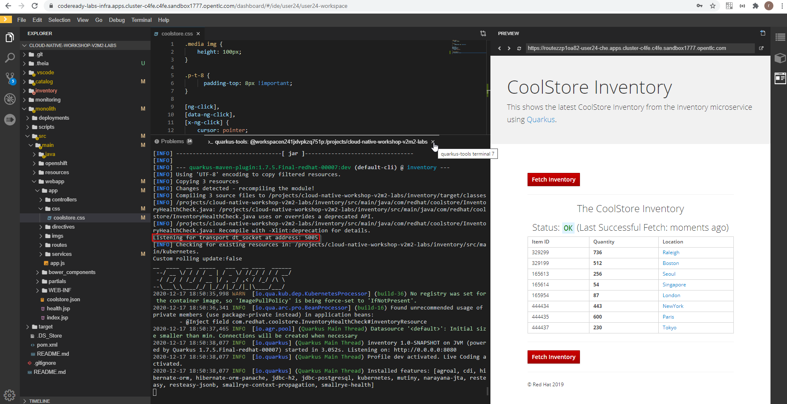
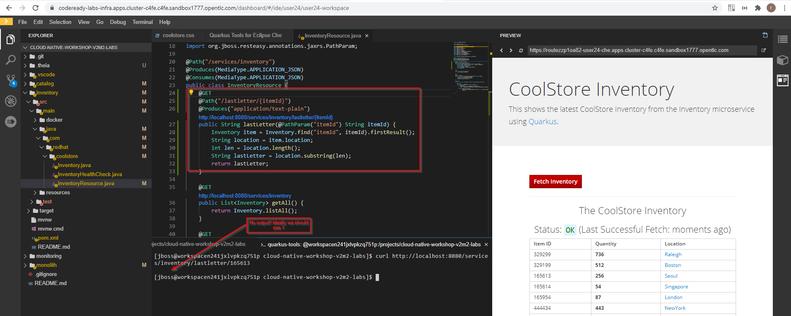
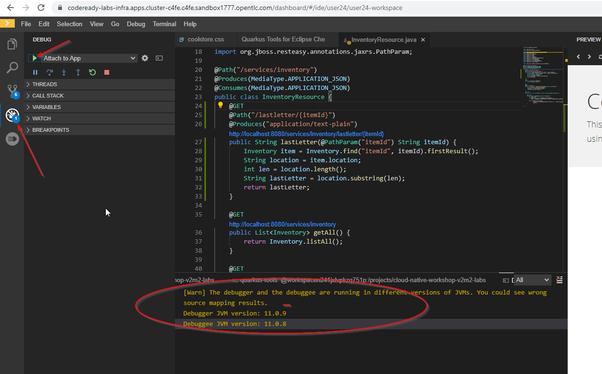
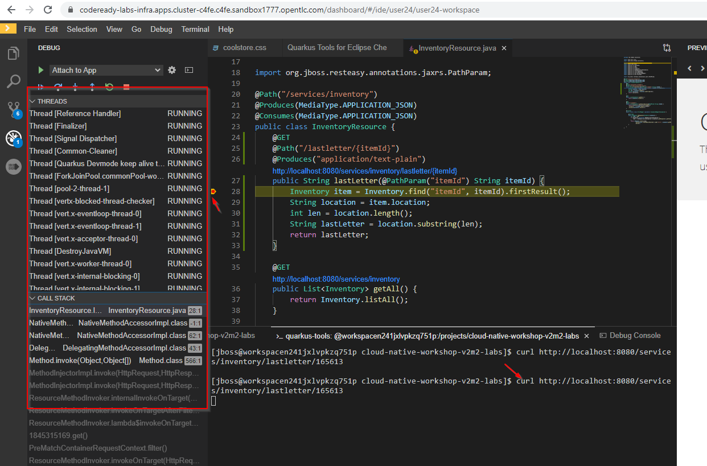
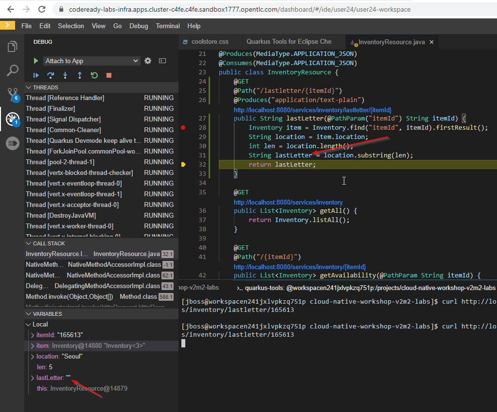

# Debugging Applications

## Enable Remote Debugging
Quarkus in development mode enables "Live Coding" with background compilation, which means that when you modify your Java files and/or your resource files and refresh your browser, these changes will automatically take effect. This works too for resource files like the configuration properties files and even pom.xml changes.

When run in Developer Mode (i.e. mvn quarkus:dev), Quarkus will also listen for debugging sessions on port 5005 (by default). If your want to wait for the debugger to attach before running you can pass -Ddebug on the command line. If you don’t want the debugger at all you can use -Ddebug=false.

```
mvn quarkus:dev -f $CHE_PROJECTS_ROOT/cloud-native-workshop-v2m2-labs/inventory
	2020-12-17 18:50:38,077 INFO  [io.quarkus] (Quarkus Main Thread) inventory 1.0-SNAPSHOT on JVM (powered by Quarkus 1.7.5.Final-redhat-00007) started in 3.052s. Listening on: http://0.0.0.0:8080
	2020-12-17 18:50:38,077 INFO  [io.quarkus] (Quarkus Main Thread) Profile dev activated. Live Coding activated.
	2020-12-17 18:50:38,077 INFO  [io.quarkus] (Quarkus Main Thread) Installed features: [agroal, cdi, hibernate-orm, hibernate-orm-panache, jdbc-h2, jdbc-postgresql, kubernetes, mutiny, narayana-jta, resteasy, resteasy-jsonb, smallrye-context-propagation, smallrye-health]
```



## Add a bug

```
@GET
@Path("/lastletter/{itemId}")
@Produces("application/text-plain")
public String lastLetter(@PathParam("itemId") String itemId) {
    Inventory item = Inventory.find("itemId", itemId).firstResult();
    String location = item.location;
    int len = location.length();
    String lastLetter = location.substring(len);
    return lastLetter;
}
```

Explorer view, and under the cloud-native-workshop-v2m2-labs project, open the ```inventory/src/main/java/com/redhat/coolstore/InventoryResource.java```



## Debug with CodeReady Workspaces





## Here is the issue:



## Fix:


