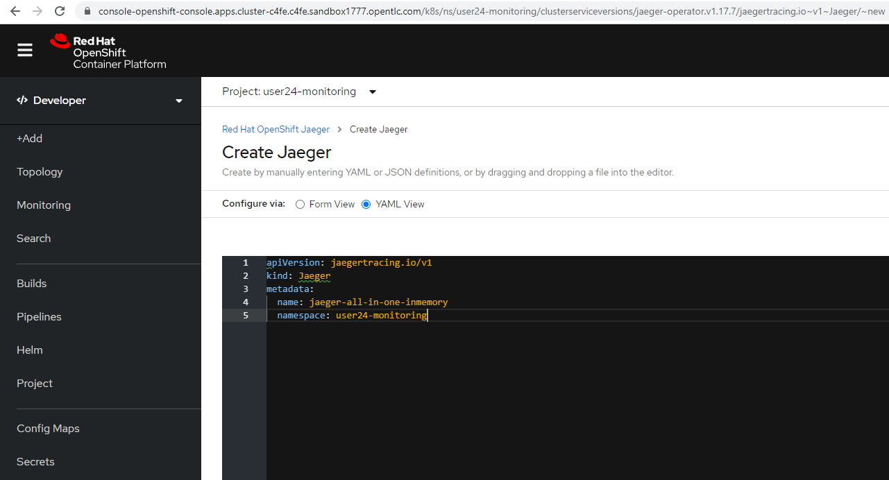
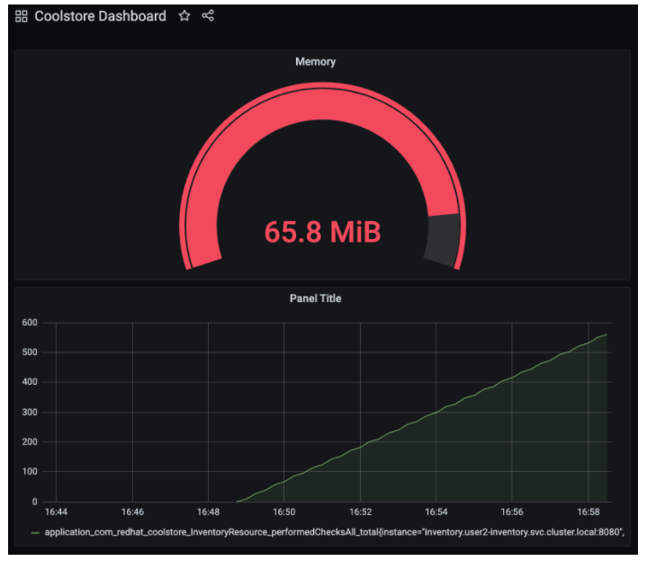

# Application Monitoring

In this lab, you will monitor coolstore applications using Jaeger and Prometheus.


Jaeger is an open source distributed tracing tool for monitoring and troubleshooting microservices-based distributed systems including:
	• Distributed context propagation
	• Distributed transaction monitoring
	• Root cause analysis
	• Service dependency analysis
	• Performance and latency optimization

Prometheus is an open source systems monitoring and alerting tool that fits in recording any numeric time series including:
	• Multi-dimensional time series data by metric name and key/value pairs
	• No reliance on distributed storage
	• Time series collection over HTTP
	• Pushing time series is supported via an intermediary gateway
	• Service discovery or static configuration


```
apiVersion: jaegertracing.io/v1
kind: Jaeger
metadata:
  name: jaeger-all-in-one-inmemory
  namespace: user24-monitoring
```



https://jaeger-all-in-one-inmemory-user24-monitoring.apps.cluster-c4fe.c4fe.sandbox1777.opentlc.com/


## Utilizing Opentracing with Inventory (Quarkus)

```
mvn -q quarkus:add-extension -Dextensions="smallrye-opentracing" -f $CHE_PROJECTS_ROOT/cloud-native-workshop-v2m2-labs/inventory
	✅ Extension io.quarkus:quarkus-smallrye-opentracing has been installed
```

### Create the configuration


We will configure our app to use the http-c-binary-trft service on port 14268 to report traces.
In the inventory project under cloud-native-workshop-v2m2-labs workspace, open ```src/main/resources/application.properties file```


### Re-Deploy to OpenShift

```
oc project user24-inventory && \
mvn package -DskipTests -f $CHE_PROJECTS_ROOT/cloud-native-workshop-v2m2-labs/inventory
	…
	…
	…
	[INFO] [io.quarkus.container.image.s2i.deployment.S2iProcessor] Push successful
	[INFO] [io.quarkus.kubernetes.deployment.KubernetesDeployer] Deploying to openshift server: https://172.30.0.1:443/ in namespace: user24-inventory.
	[INFO] [io.quarkus.kubernetes.deployment.KubernetesDeployer] Applied: ServiceAccount inventory.
	[INFO] [io.quarkus.kubernetes.deployment.KubernetesDeployer] Applied: Service inventory.
	[INFO] [io.quarkus.kubernetes.deployment.KubernetesDeployer] Applied: ImageStream inventory.
	[INFO] [io.quarkus.kubernetes.deployment.KubernetesDeployer] Applied: ImageStream openjdk-11.
	[INFO] [io.quarkus.kubernetes.deployment.KubernetesDeployer] Applied: BuildConfig inventory.
	[INFO] [io.quarkus.kubernetes.deployment.KubernetesDeployer] Applied: DeploymentConfig inventory.
	[INFO] [io.quarkus.kubernetes.deployment.KubernetesDeployer] Applied: Route inventory.
	[INFO] [io.quarkus.kubernetes.deployment.KubernetesDeployer] The deployed application can be accessed at: http://inventory-user24-inventory.apps.cluster-c4fe.c4fe.sandbox1777.opentlc.com
	[INFO] [io.quarkus.deployment.QuarkusAugmentor] Quarkus augmentation completed in 52046ms
	[INFO] ------------------------------------------------------------------------
	[INFO] BUILD SUCCESS
	[INFO] ------------------------------------------------------------------------
	[INFO] Total time:  56.376 s
	[INFO] Finished at: 2020-12-17T19:57:58Z
	[INFO] ------------------------------------------------------------------------
```


### Observing Jaeger Tracing

```
URL="http://$(oc get route -n user24-inventory inventory -o jsonpath="{.spec.host}")"

for i in $(seq 1 10) ; do
  curl -s $URL/services/inventory/165613
  sleep .2
done
	[{"id":3,"itemId":"165613","link":"http://maps.google.com/?q=Seoul","location":"Seoul","quantity":256}]
	[{"id":3,"itemId":"165613","link":"http://maps.google.com/?q=Seoul","location":"Seoul","quantity":256}]
	[{"id":3,"itemId":"165613","link":"http://maps.google.com/?q=Seoul","location":"Seoul","quantity":256}]
	[{"id":3,"itemId":"165613","link":"http://maps.google.com/?q=Seoul","location":"Seoul","quantity":256}]
	[{"id":3,"itemId":"165613","link":"http://maps.google.com/?q=Seoul","location":"Seoul","quantity":256}]
	[{"id":3,"itemId":"165613","link":"http://maps.google.com/?q=Seoul","location":"Seoul","quantity":256}]
	[{"id":3,"itemId":"165613","link":"http://maps.google.com/?q=Seoul","location":"Seoul","quantity":256}]
	[{"id":3,"itemId":"165613","link":"http://maps.google.com/?q=Seoul","location":"Seoul","quantity":256}]
	[{"id":3,"itemId":"165613","link":"http://maps.google.com/?q=Seoul","location":"Seoul","quantity":256}]
	[{"id":3,"itemId":"165613","link":"http://maps.google.com/?q=Seoul","location":"Seoul","quantity":256}]
```


## Deploy Prometheus and Grafana to OpenShift

we will deploy custom Prometheus to scrape services metrics of Inventory and Catalog applications. Then we will visualize the metrics data via custom Grafana dashboards deployment.


## Setting up Prometheus


## Setting up Grafana


## The Topology


## Open Prometheus:


## Open Grafana


### Utilize metrics specification for Inventory Microservice
we will learn how Inventory(Quarkus) application can utilize the MicroProfile Metrics specification through the SmallRye Metrics extension. MicroProfile Metrics allows applications to gather various metrics and statistics that provide insights into what is happening inside the application.

```
mvn -q quarkus:add-extension -Dextensions="smallrye-metrics" -f $CHE_PROJECTS_ROOT/cloud-native-workshop-v2m2-labs/inventory
	✅ Extension io.quarkus:quarkus-smallrye-metrics has been installed
```

In the cloud-native-workshop-v2m2-labs/inventory project, open ```src/main/java/com/redhat/coolstore/InventoryResource.java```

```
@GET
@Counted(name = "performedChecksAll", description = "How many getAll() have been performed.")
@Timed(name = "checksTimerAll", description = "A measure of how long it takes to perform the getAll().", unit = MetricUnits.MILLISECONDS)
public List<Inventory> getAll() {
    return Inventory.listAll();
}

@GET
@Counted(name = "performedChecksAvail", description = "How many getAvailability() have been performed.")
@Timed(name = "checksTimerAvail", description = "A measure of how long it takes to perform the getAvailability().", unit = MetricUnits.MILLISECONDS)
@Path("{itemId}")
public List<Inventory> getAvailability(@PathParam String itemId) {
    return Inventory.<Inventory>streamAll()
    .filter(p -> p.itemId.equals(itemId))
    .collect(Collectors.toList());
}
```

Imports

```
import org.eclipse.microprofile.metrics.MetricUnits;
import org.eclipse.microprofile.metrics.annotation.Counted;
import org.eclipse.microprofile.metrics.annotation.Timed;
```

## Redeploy to OpenShift

```
oc project user24-inventory && \
mvn clean package -DskipTests -f $CHE_PROJECTS_ROOT/cloud-native-workshop-v2m2-labs/inventory
	…
	…
	…
	[INFO] [io.quarkus.container.image.s2i.deployment.S2iProcessor] Pushing image image-registry.openshift-image-registry.svc:5000/user24-inventory/inventory:1.0-SNAPSHOT ...
	[INFO] [io.quarkus.container.image.s2i.deployment.S2iProcessor] Getting image source signatures
	[INFO] [io.quarkus.container.image.s2i.deployment.S2iProcessor] Copying blob sha256:62ff7fd61f04746ce748767df066bfcdd72764ac199f93ab26c19e9bbb01b39f
	[INFO] [io.quarkus.container.image.s2i.deployment.S2iProcessor] Copying blob sha256:4753a4528f5f857083f7c31ba761a3ed67c0005660cc488d96b1b80165946a38
	[INFO] [io.quarkus.container.image.s2i.deployment.S2iProcessor] Copying blob sha256:0bfa3caede844868c4f968e754b053001d0e1710be36b27530943dda4680067a
	[INFO] [io.quarkus.container.image.s2i.deployment.S2iProcessor] Copying blob sha256:c0194df27effde85019e70c3b7a3f2571c3aabe30f5b0c96c86ed528a0ca06c1
	[INFO] [io.quarkus.container.image.s2i.deployment.S2iProcessor] Copying config sha256:467f9d0c7414179320b280aad58fc882c285663719220967e2df639c8ab3990c
	[INFO] [io.quarkus.kubernetes.deployment.KubernetesDeployer] Deploying to openshift server: https://172.30.0.1:443/ in namespace: user24-inventory.
	[INFO] [io.quarkus.kubernetes.deployment.KubernetesDeployer] Applied: ServiceAccount inventory.
	[INFO] [io.quarkus.kubernetes.deployment.KubernetesDeployer] Applied: Service inventory.
	[INFO] [io.quarkus.kubernetes.deployment.KubernetesDeployer] Applied: ImageStream inventory.
	[INFO] [io.quarkus.kubernetes.deployment.KubernetesDeployer] Applied: ImageStream openjdk-11.
	[INFO] [io.quarkus.kubernetes.deployment.KubernetesDeployer] Applied: BuildConfig inventory.
	[INFO] [io.quarkus.kubernetes.deployment.KubernetesDeployer] Applied: DeploymentConfig inventory.
	[INFO] [io.quarkus.kubernetes.deployment.KubernetesDeployer] Applied: Route inventory.
	[INFO] [io.quarkus.kubernetes.deployment.KubernetesDeployer] The deployed application can be accessed at: http://inventory-user24-inventory.apps.cluster-c4fe.c4fe.sandbox1777.opentlc.com
	[INFO] [io.quarkus.deployment.QuarkusAugmentor] Quarkus augmentation completed in 58813ms
	[INFO] ------------------------------------------------------------------------
	[INFO] BUILD SUCCESS
	[INFO] ------------------------------------------------------------------------
	[INFO] Total time:  01:03 min
	[INFO] Finished at: 2020-12-17T21:05:42Z
	[INFO] ------------------------------------------------------------------------
```

Once it’s done you should be able to see the raw metrics exposed by the app with this command in a Terminal:

```
curl http://invento......ry-user24-inventory.apps.cluster-c4fe.c4fe.sandbox1777.opentlc.com/metrics
	…
	…
	…
	# HELP vendor_memoryPool_usage_bytes Current usage of the memory pool denoted by the 'name' tag
	# TYPE vendor_memoryPool_usage_bytes gauge
	vendor_memoryPool_usage_bytes{name="CodeHeap 'non-nmethods'"} 1260032.0
	vendor_memoryPool_usage_bytes{name="CodeHeap 'non-profiled nmethods'"} 898048.0
	vendor_memoryPool_usage_bytes{name="CodeHeap 'profiled nmethods'"} 4641920.0
	vendor_memoryPool_usage_bytes{name="Compressed Class Space"} 4746016.0
	vendor_memoryPool_usage_bytes{name="Eden Space"} 0.0
	vendor_memoryPool_usage_bytes{name="Metaspace"} 3.7295032E7
	vendor_memoryPool_usage_bytes{name="Survivor Space"} 0.0
	vendor_memoryPool_usage_bytes{name="Tenured Gen"} 1.3550728E7
	# HELP vendor_memoryPool_usage_max_bytes Peak usage of the memory pool denoted by the 'name' tag
	# TYPE vendor_memoryPool_usage_max_bytes gauge
	vendor_memoryPool_usage_max_bytes{name="CodeHeap 'non-nmethods'"} 1276928.0
	vendor_memoryPool_usage_max_bytes{name="CodeHeap 'non-profiled nmethods'"} 915328.0
	vendor_memoryPool_usage_max_bytes{name="CodeHeap 'profiled nmethods'"} 4900736.0
	vendor_memoryPool_usage_max_bytes{name="Compressed Class Space"} 4746016.0
	vendor_memoryPool_usage_max_bytes{name="Eden Space"} 9.5691792E7
	vendor_memoryPool_usage_max_bytes{name="Metaspace"} 3.7295352E7
	vendor_memoryPool_usage_max_bytes{name="Survivor Space"} 0.0
	vendor_memoryPool_usage_max_bytes{name="Tenured Gen"} 1.3550728E7
```

### Configure Prometheus ConfigMap
YAML FILE
```
apiVersion: v1
kind: ConfigMap
metadata:
  name: prometheus-config
  namespace: user24-monitoring
data:
  prometheus.yml: >-
    scrape_configs:
      - job_name: 'prometheus'
        static_configs:
        - targets: ['localhost:9090']

      - job_name: 'inventory-quarkus'
        scrape_interval: 10s
        scrape_timeout: 5s
        static_configs:
        - targets: ['inventory.user24-inventory.svc.cluster.local:8080']
```


Config maps hold key-value pairs and in the above command a prometheus-config config map is created with prometheus.yml as the key and the above content as the value. Whenever a config map is injected into a container, it would appear as a file with the same name as the key, at specified path on the filesystem.


Next, we need to mount this ConfigMap in the filesystem of the Prometheus container so that it can read it. Run this command to alter the Prometheus deployment to mount it:

```
oc set volume -n user24-monitoring deployment/prometheus --add -t configmap --configmap-name=prometheus-config -m /etc/prometheus/prometheus.yml --sub-path=prometheus.yml && \
oc rollout status -n user24-monitoring -w deployment/prometheus
	I1217 21:12:57.981371    3843 request.go:621] Throttling request took 1.143209906s, request: GET:https://172.30.0.1:443/apis/snapshot.storage.k8s.io/v1beta1?timeout=32s
	info: Generated volume name: volume-q5wcx
	deployment.apps/prometheus volume updated
	Waiting for deployment "prometheus" rollout to finish: 1 old replicas are pending termination...
	Waiting for deployment "prometheus" rollout to finish: 1 old replicas are pending termination...
	deployment "prometheus" successfully rolled out
```

### Generate some values for the metrics

```
URL=http://$(oc get route -n user24-inventory inventory -o jsonpath="{.spec.host}")

for i in $(seq 1 600) ; do
  curl -s $URL/services/inventory/165613
  curl -s $URL/services/inventory
  sleep 1
done
	…
	…
	…
	ntity":736},{"id":2,"itemId":"329199","link":"http://maps.google.com/?q=Boston","location":"Boston","quantity":512},{"id":3,"itemId":"165613","link":"http://maps.google.com/?q=Seoul","location":"Seoul","quantity":256},{"id":4,"itemId":"165614","link":"http://maps.google.com/?q=Singapore","location":"Singapore","quantity":54},{"id":5,"itemId":"165954","link":"http://maps.google.com/?q=London","location":"London","quantity":87},{"id":6,"itemId":"444434","link":"http://maps.google.com/?q=NewYork","location":"NewYork","quantity":443},{"id":7,"itemId":"444435","link":"http://maps.google.com/?q=Paris","location":"Paris","quantity":600},{"id":8,"itemId":"444437","link":"http://maps.google.com/?q=Tokyo","location":"Tokyo","quantity":230}]
	[{"id":3,"itemId":"165613","link":"http://maps.google.com/?q=Seoul","location":"Seoul","quantity":256}]
	[{"id":1,"itemId":"329299","link":"http://maps.google.com/?q=Raleigh","location":"Raleigh","quantity":736},{"id":2,"itemId":"329199","link":"http://maps.google.com/?q=Boston","location":"Boston","quantity":512},{"id":3,"itemId":"165613","link":"http://maps.google.com/?q=Seoul","location":"Seoul","quantity":256},{"id":4,"itemId":"165614","link":"http://maps.google.com/?q=Singapore","location":"Singapore","quantity":54},{"id":5,"itemId":"165954","link":"http://maps.google.com/?q=London","location":"London","quantity":87},{"id":6,"itemId":"444434","link":"http://maps.google.com/?q=NewYork","location":"NewYork","quantity":443},{"id":7,"itemId":"444435","link":"http://maps.google.com/?q=Paris","location":"Paris","quantity":600},{"id":8,"itemId":"444437","link":"http://maps.google.com/?q=Tokyo","location":"Tokyo","quantity":230}]
	[{"id":3,"itemId":"165613","link":"http://maps.google.com/?q=Seoul","location":"Seoul","quantity":256}]
	[{"id":1,"itemId":"329299","link":"http://maps.google.com/?q=Raleigh","location":"Raleigh","quantity":736},{"id":2,"itemId":"329199","link":"http://maps.google.com/?q=Boston","location":"Boston","quantity":512},{"id":3,"itemId":"165613","link":"http://maps.google.com/?q=Seoul","location":"Seoul","quantity":256},{"id":4,"itemId":"165614","link":"http://maps.google.com/?q=Singapore","location":"Singapore","quantity":54},{"id":5,"itemId":"165954","link":"http://maps.google.com/?q=London","location":"London","quantity":87},{"id":6,"itemId":"444434","link":"http://maps.google.com/?q=NewYork","location":"NewYork","quantity":443},{"id":7,"itemId":"444435","link":"http://maps.google.com/?q=Paris","location":"Paris","quantity":600},{"id":8,"itemId":"444437","link":"http://maps.google.com/?q=Tokyo","location":"Tokyo","quantity":230}]
	…
	…
	…
```


------------------------------------------------------------------------------------------------------------------------------------------------------


## Using Prometheus
Open the Prometheus UI and input performedChecks and select the auto-completed value:


## Switch to Graph tab:


You can play with the values for time and see different data across different time ranges for this metric. There are many other metrics you can query for, and perform quite complex queries using Prom QL (Prometheus Query Language).

## Using Grafana
Open the Grafana UI.

Select New Dashboard to create a new Dashboard to review the metrics.


	
Click on Add new panel to add a new panel with a query:


Type in performedChecks in the Metrics field, and choose the first auto-completed value:


Press ENTER while the cursor is in the field, and the values should begin showing up. Choose Last 15 Minutes in the drop-down as shown:


You can fine tune the display, along with the type of graph (bar, line, gauge, etc). Using other options. When done, click the Save button, give your new dashboard a name, and click Save:


This is optional, but you can add more Panels if you like, for example: The JVM RSS Value process_resident_memory_bytes (set the Visualization to Gauge and the Unit in Field tab to bytes(IEC) on the Visualization, and the title to Memory on the Panel Title). It could look like:



## Extra Credit: Spring Boot
I you feel up to it, Spring Boot can also expose Metrics which can be collected by Prometheus and displayed with Grafana. To add metrics support to your Catalog service written with Spring Boot, you’ll need to:
Add dependencies for Spring Boot Actuator and Prometheus
Configure application-openshift.properties with config values
Re-build and Re-deploy the app to OpenShift (in the user24-catalog project) using commands from previous modules
Edit the Prometheus ConfigMap to add another scrape job pointing at catalog-springboot.user24-catalog.svc.cluster.local:8080
Re-deploy Prometheus to pick up the new config
Attempt to query Prometheus for the Spring Boot metrics(i.e. scrape_duration_seconds)
It is beyond the scope of this lab, but if you’re interested, give it a go if you have extra time!

# Summary
In this lab, you learned how to monitor cloud-native applications using Jaeger, Prometheus, and Grafana. You also learned how Quarkus makes your observation tasks easier as a developer and operator. You can use these techniques in future projects to observe your distributed cloud-native applications.


